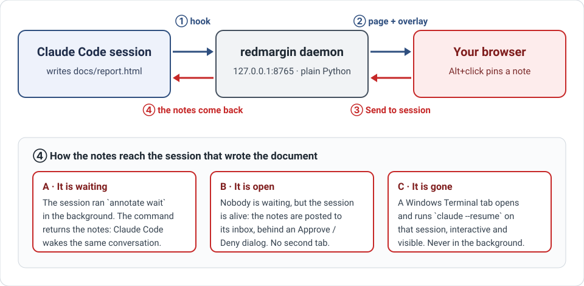

# docpin

**React to the documents Claude Code writes. Pin a note on any passage, right in your browser — the notes
flow back to the session that wrote the document, and it fixes it.**



A long answer from Claude Code is hard to read in a terminal and awkward to answer. docpin gives every
HTML document the session writes a page in your browser, and a way to react to it in place.

A Claude Code session writes `docs/report.html`. You open it, Alt+click the sentence that is wrong,
type what you want instead, click **Send to session**. The session that wrote the document receives
your notes — each one carries the passage it points at — corrects the file on disk, and waits for the
next round. No copy-pasting of quotes into the terminal, no “which paragraph did I mean?”.

- **The notes go to the conversation that wrote the document**, not to a fresh one. If that session is
  still open, nothing else opens; if it is gone, a terminal tab resumes it.
- **Nothing to install in the browser.** The daemon serves your document with an annotation layer
  injected. Any browser works.
- **No runtime dependency.** The daemon is `http.server`, the configuration is `tomllib`, the registry
  is `json`. Python 3.12+ and nothing else.
- **Your repository stays clean.** Notes live under `~/.local/share/annotate`, never next to the
  document.
- **A note never gets lost.** If you edit the document and a note's anchor no longer resolves, the note
  moves to an “orphans” list and is still sent, with the passage it quoted.

## Status

Early (v0.1), used daily by its author. The core loop — hook, daemon, overlay, the three delivery
routes — is covered by a test suite that never launches a real `claude`, `systemctl`, `wt.exe` or
signal (guards fail the test instead). The first real end-to-end send was done on 2026-10-05. Not yet
measured: Alt+click in a real Windows Chrome (it is tested in headless Chromium on Linux), and the
look of the tray icon. See [ROADMAP.md](ROADMAP.md).

## Requirements

| | Needed for | Notes |
|---|---|---|
| Python ≥ 3.12 and [uv](https://docs.astral.sh/uv/) | everything | no runtime package is installed |
| [Claude Code](https://claude.com/claude-code) | everything | the hook and `annotate wait` run inside its sessions |
| systemd user services | the daemon as a service | `loginctl enable-linger $USER`, or it dies with your last session |
| Windows Terminal (`wt.exe`) | route C: resuming a session that is gone | developed on WSL2; the rest of the loop is plain HTTP |
| Windows | the tray icon | optional |

Developed and tested on WSL2 + Windows. A native Linux or macOS setup should run the daemon, the hook
and routes A and B, but it has not been tried; routes C and the tray icon are Windows-only today.

## Install

```bash
git clone https://github.com/elphono/docpin.git
cd docpin
uv sync

uv run annotate service                       # writes ~/.config/systemd/user/annotate.service
loginctl enable-linger $USER
systemctl --user daemon-reload
systemctl --user enable --now annotate.service
uv run annotate status                        # daemon up on :8765, 0 document(s)

uv run annotate tray --start                  # optional, Windows: tray icon + Startup shortcut
```

Then register the hook, so that every HTML document a session writes in a **tracked folder** is
registered with **that session's id**. In `~/.claude/settings.json`:

```json
{
  "hooks": {
    "PostToolUse": [
      {
        "matcher": "Write|Edit",
        "hooks": [
          { "type": "command",
            "command": "python3 /path/to/docpin/hooks/register-on-write.py",
            "timeout": 15 }
        ]
      }
    ]
  }
}
```

Hooks load when a session starts: open a **new** session after editing the file. The daemon also
walks the tracked folders every 30 seconds, which catches documents written by Bash (`cp` from a
scratchpad, subagents) that never go through the hook.

**Tracked folders.** Out of the box, one: the `docs/` folders of your workspace (`~/workspace`
unless you set `ANNOTATE_WORKSPACE`). Add any folder under your home directory from the home page
(or `annotate folders add <folder>`): every `.html` file under it is tracked, except in `build/`,
`node_modules/`, `figures/` and the like. Adding a folder takes its files of the last days;
**Rescan all folders** does the same everywhere, for 1, 7, 30 or 90 days. A document you unmanaged
stays out until it is written again.

## Use

1. In a Claude Code session, ask for an HTML document in a tracked folder. The hook registers it and
   tells the session to run `annotate wait <id>` in the background.
2. Open the home page (`http://127.0.0.1:8765/`, or a left click on the tray icon), then the document.
3. **Alt+click** anywhere to pin a note. Select text first and the note quotes exactly that selection.
4. **Send to session** (the bar, the home page, the tray, or `annotate send <id>`). Only notes that were
   never sent go out.

The home page groups documents by session — its title, then its folder — and carries every control:
Open, Send to session, New session, Unmanage, Delete file; the tracked folders and the rescan; and
Restart / Stop for the daemon.

```bash
uv run annotate list                 # one line per document
uv run annotate send <id>            # same as the button
uv run annotate new-session <id>     # the unsent notes go to a NEW session (a terminal tab)
uv run annotate forget <id> [--delete]
uv run annotate folders [add|remove <folder>]   # the tracked folders
uv run annotate rescan [--days 7] [--folder F]  # register what was written recently
uv run annotate status
```

Configuration is optional: `~/.config/annotate/config.toml` (`port`, `claude_bin`), overridden by
`ANNOTATE_PORT` and `ANNOTATE_CLAUDE`. Data lives under `ANNOTATE_DATA_DIR`
(default `~/.local/share/annotate`).

## Security

The daemon listens on `127.0.0.1` only, and `send` starts a session that is allowed to edit files, so a
web page you merely visit must not be able to trigger it: every request that changes anything needs the
custom `X-Annotate` header (which forces a CORS preflight the daemon never grants), a local `Origin`,
and a `Host` that names localhost (DNS rebinding). `/docs/<id>/files/` serves nothing outside the
document's folder, symbolic links included.

## Develop

```bash
uv run pytest -q                          # default suite
uv run ruff check src tests tools hooks
uv run mypy
uv run python tools/mutate.py             # directed mutation campaign, run on a copy of the repo
```

The invariants and the lessons behind them are in [CLAUDE.md](CLAUDE.md) (in French). The design
study that fixed the main choices is [docs/etude-reutilisation.html](docs/etude-reutilisation.html)
(French; GitHub shows HTML as source, so open it from a clone).

## License

[MIT](LICENSE).

## Name

**docpin**: pin a note on a doc. The command line is still `annotate`, and so is the Python package, so that nothing you have set up breaks.
